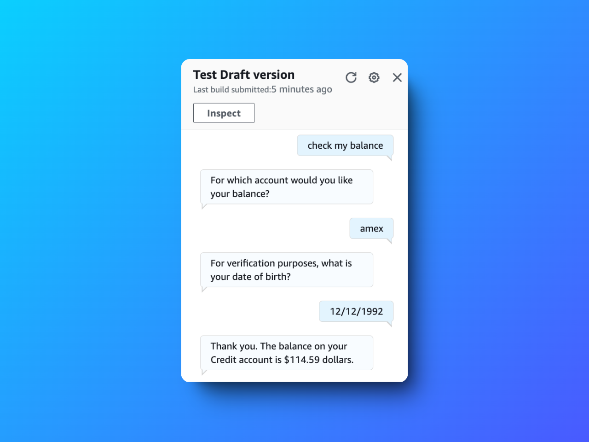
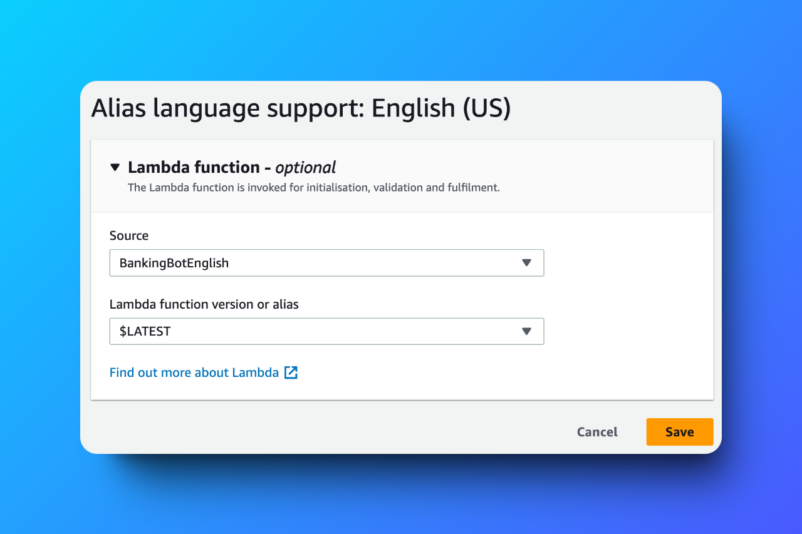
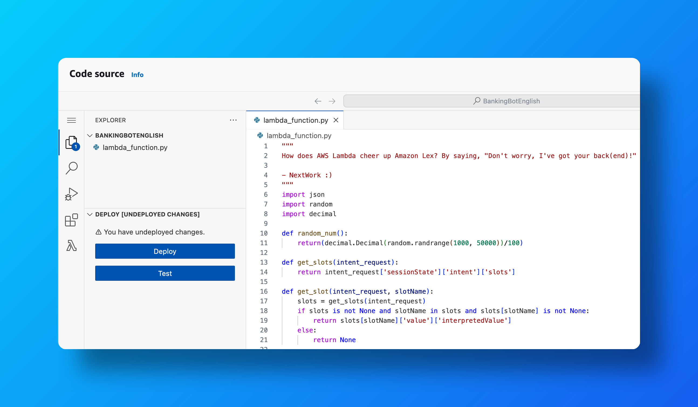
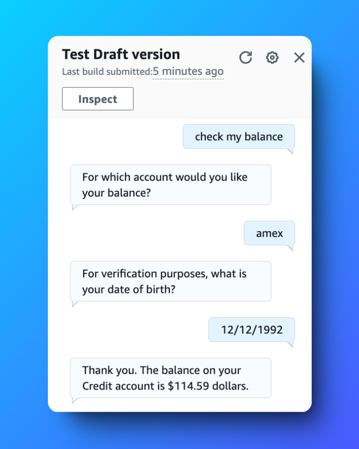

# Connect a Chatbot with AWS Lambda 🤖

---

## 📜 Table of Contents

1. [Project Overview](#project-overview)
2. [Features](#features)
3. [Key Deliverables](#key-deliverables)
4. [Challenges and Lessons Learned](#challenges-and-lessons-learned)
5. [Outcome](#outcome)
6. [Tools and Technologies Used](#tools-and-technologies-used)
7. [Steps to Reproduce](#steps-to-reproduce)
8. [Screenshots](#screenshots)
9. [Acknowledgments](#acknowledgments)
10. [Author](#author)

---

## Project Overview

This project demonstrates how to connect an **Amazon Lex** chatbot to an **AWS Lambda** function to enable dynamic and personalized user interactions. The chatbot, named **BankerBot**, uses intents like "CheckBalance" and "FollowupCheckBalance" to fetch and display random bank balance figures, providing users with an interactive and responsive banking experience.

---

## Features

- **Dynamic Responses**: Retrieves random bank balances based on user input.
- **Seamless Integration**: Combines Amazon Lex's natural language capabilities with AWS Lambda's compute power.
- **Scalable Design**: Supports scaling to handle increasing user requests efficiently.
- **Custom Logic with Code Hooks**: Enhances bot behavior by triggering custom Lambda functions during conversations.

---

## Key Deliverables

1. **Amazon Lex Chatbot**:
   - Configured intents like "CheckBalance" with sample utterances and responses.
   - Implemented a fallback intent for handling unrecognized queries.

2. **AWS Lambda Function**:
   - Created a Lambda function to dynamically generate random bank balances.
   - Linked the function to Lex via code hooks for fulfilling intents.

3. **Testing and Validation**:
   - Tested the chatbot with various inputs to ensure accurate and consistent responses.

---

## Challenges and Lessons Learned

### Challenges
- Configuring Lambda code hooks for real-time interaction between Lex and Lambda.
- Ensuring that session attributes passed correctly for personalized responses.

### Lessons Learned
- Amazon Lex and Lambda integration simplifies creating dynamic, user-focused solutions.
- Proper configuration of intents and hooks is crucial for accurate chatbot responses.

---

## Outcome

The **BankerBot** chatbot successfully interacts with users, triggers Lambda functions, and provides personalized banking information. This project highlights the potential of integrating conversational AI with serverless computing to create scalable and intelligent applications.

---

## Tools and Technologies Used

- **Amazon Lex**: For building and managing the chatbot.
- **AWS Lambda**: For serverless computation and intent fulfillment.
- **AWS CloudWatch**: For monitoring and debugging chatbot and Lambda interactions.

---

## Steps to Reproduce

1. **Create an Amazon Lex Bot**:
   - Configure intents like "CheckBalance" with sample utterances.
   - Define default and fallback responses.

2. **Develop a Lambda Function**:
   - Write a function in Python or Node.js to generate random responses.
   - Use session attributes for personalized responses.

3. **Integrate Lex with Lambda**:
   - Navigate to Lex bot settings and link the Lambda function as a fulfillment code hook.

4. **Test the Chatbot**:
   - Use the Lex console to simulate user inputs and validate responses.

---

## Screenshots

### Lex Chatbot Lambda Attachment  

### Lambda Function Code  

### Chatbot Testing Results  

---

## Acknowledgments

Gratitude to the **NextWork Community** for their guidance and to AWS for providing powerful tools for conversational AI and serverless computing.

---

## Author

**Hassan Gachoka**  

